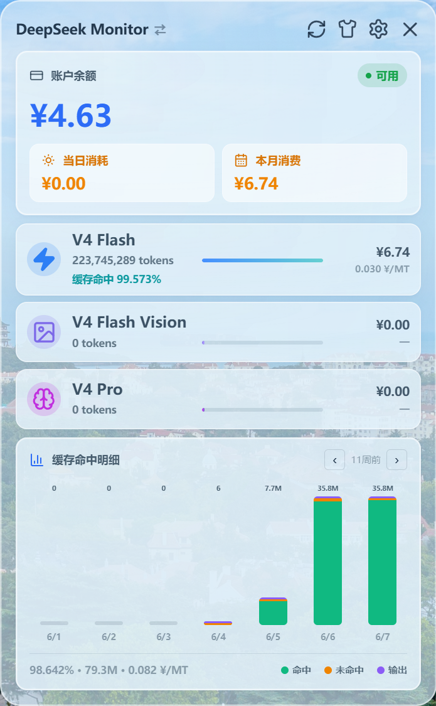
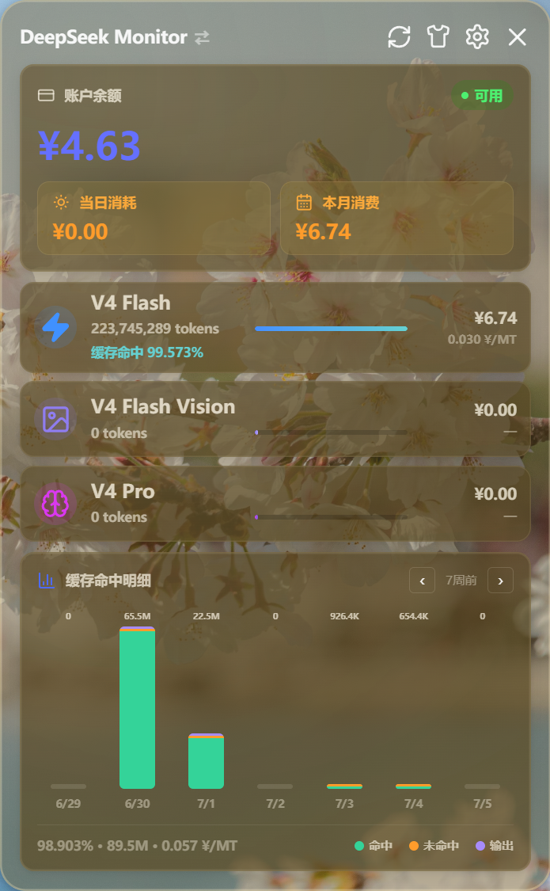

# DeepSeek / MiMo Monitor Windows

<div align="center">

[](https://github.com/HaoyueQin/DeepSeekMonitorWindows/releases/latest)
[](https://github.com/HaoyueQin/DeepSeekMonitorWindows/actions/workflows/ci.yml)
[](https://github.com/HaoyueQin/DeepSeekMonitorWindows/actions/workflows/release.yml)
[](https://github.com/HaoyueQin/DeepSeekMonitorWindows/releases/latest)


**简体中文** | [English](README.en.md)

</div>

---

一个面向 Windows 的 DeepSeek & MiMo API 用量监控桌面应用：查看账户余额、当日消耗、当月消费、各模型 Token 用量与缓存命中率，以及按周翻页的用量趋势。

> **郑重声明**：本项目不是 DeepSeek 官方产品，也不是 MiMo 官方产品，与两家公司无任何关联。

## 效果展示

| 浅色模式 | 深色模式 |
| --- | --- |
|  |  |

> 主面板：账户余额、当日 / 本月消费，V4 Flash · V4 Flash Vision · V4 Pro 三行模型用量与七日趋势图。

## 功能特性

### DeepSeek 平台
- 查询账户余额（官方余额接口；多币种返回时自动优先 CNY 条目）。
- 查询平台用量数据：当月消费、模型 Token 总量、请求数、缓存命中 / 未命中、输出 Token。
- 支持 **V4 Flash / V4 Flash Vision（deepseek-v4-flash-vision-exp）/ V4 Pro** 三类模型用量行，各自独立配色与图标。
- 最近 7 天消费趋势图与模型详情页，均可按周翻页浏览历史数据。
- 用量 Token 网页登录自动同步（WebView 捕获），支持手动粘贴兜底；历史数据本地缓存，最多可回看 36 个月。

### MiMo 平台
- 顶部按钮一键切换 DeepSeek / MiMo。
- 余额查询与按模型（V2.5 / V2.5 Pro）、按日期分解的用量明细。
- WebView 隐藏窗口静默查询，仅在需要登录时弹出；401 自动引导登录。

### 应用层
- 低余额 Windows 通知提醒，阈值与通知冷却时间可配置。
- 自动刷新（全局间隔 + MiMo 专属间隔）、开机自启、窗口置顶、托盘常驻。
- 数据导出（JSON / CSV）、导入、缓存清理与历史深度管理。
- 应用内检查更新并自动安装（签名校验的增量更新器）。
- 液态玻璃质感 UI，深色 / 浅色 / 跟随系统三套主题，中英双语界面。

## 系统要求

- Windows 10 或 Windows 11。
- Microsoft Edge WebView2 Runtime（Windows 11 通常已内置；Windows 10 如缺失需单独安装）。

## 下载安装

从 [GitHub Releases](https://github.com/HaoyueQin/DeepSeekMonitorWindows/releases/latest) 下载 `DeepSeekMonitorWindows_*_x64-setup.exe` 运行即可。覆盖安装新版本前无需卸载旧版本。

应用内置自动更新：发布新版本后，在「设置 → 关于 → 检查更新」中即可升级。

## 从源码构建

开发环境要求：

- Node.js 18+ 与 npm
- Rust 1.77.2+（建议 MSVC 工具链）
- Visual Studio Build Tools 2022（勾选 *Desktop development with C++*）

```powershell
git clone https://github.com/HaoyueQin/DeepSeekMonitorWindows.git
cd DeepSeekMonitorWindows
npm install
npm run tauri:dev     # 开发调试
npm run tauri:check   # 完整检查
npx tauri build       # 构建安装包（NSIS），产物在 src-tauri/target/release/bundle/nsis/
```

## 使用说明速览

1. 在「设置 → 账户」中保存 DeepSeek API Key（来自开放平台 API Keys 页面），保存即验证余额。
2. 用量统计依赖网页端用量 Token：点击「自动同步」在弹出的登录窗口登录后自动捕获，或手动粘贴 Token。
3. 切换到 MiMo 时点击「登录 MiMo」完成一次网页登录，之后即可静默查询。
4. 托盘左键点击显示主面板；托盘右键菜单可显示 / 退出。主面板右上角依次为：刷新、主题切换、设置、隐藏到托盘。

## 数据存储

应用配置（含 API Key 与用量 Token，凭据经 Windows DPAPI 加密后落盘）存储在：

```text
%APPDATA%\DeepSeekMonitorWindows\config.json
```

**请勿提交该文件，也不要公开截图或日志中的密钥内容。** WebView2 登录缓存位于 `%LOCALAPPDATA%\com.deepseek.monitor.windows\EBWebView`，属本机运行数据。

## 项目结构

```text
DeepSeekMonitorWindows/
├── src/                         # React + TypeScript 前端
│   ├── main.tsx                 # App 入口、全局状态、多月合并缓存
│   ├── types.ts / utils.ts      # 类型定义与工具函数
│   ├── i18n.ts                  # 中英双语国际化
│   └── components/              # 主面板 / 设置 / 模型详情
├── src-tauri/                   # Tauri + Rust 后端
│   └── src/
│       ├── lib.rs               # Tauri commands、窗口管理、回调服务器
│       └── modules/             # config(DPAPI) / deepseek / mimo / tray / types
├── scripts/                     # Windows 开发脚本
└── .github/workflows/           # CI 与自动发版流水线
```

## 致谢

本项目的完整谱系——向每一代上游致敬：

| 代际 | 项目 | 说明 |
| --- | --- | --- |
| 🥇 起源 | [JayHome137/DeepSeekMonitor](https://github.com/JayHome137/DeepSeekMonitor) | macOS 菜单栏 + WidgetKit 小组件版（Swift / SwiftUI / AppKit / WidgetKit），开创了"DeepSeek 余额与用量监控"这一形态，本项目的视觉方向与产品思路源自它。 |
| 🥈 Windows 适配 | [Joyi-code/DeepSeekMonitorWindows](https://github.com/Joyi-code/DeepSeekMonitorWindows) | 按 Windows 平台以 Tauri 2 + React + Rust 重构实现的直接上游，本仓库在其基础上继续演进。 |
| 🥉 本项目 | HaoyueQin/DeepSeekMonitorWindows | 新增 MiMo 平台完整支持、V4 Flash Vision 模型适配、多币种余额修正、历史深度管理、CI 自动发版等。 |

同时感谢：

- [Tauri](https://tauri.app/)、[React](https://react.dev/) 与 [Rust](https://www.rust-lang.org/) 社区提供的出色基础设施；
- 所有通过 Issue 与讨论反馈问题的用户。

> 注：本项目 README 曾一度将上游误标为 felikschu/deepseek-monitor（一个 Python 编写的 DeepSeek 平台变化监控系统）。经核对各上游仓库的自述，正确谱系如上表所示，特此更正并向 JayHome137 与 Joyi-code 致谢。

## License

[MIT](LICENSE)
